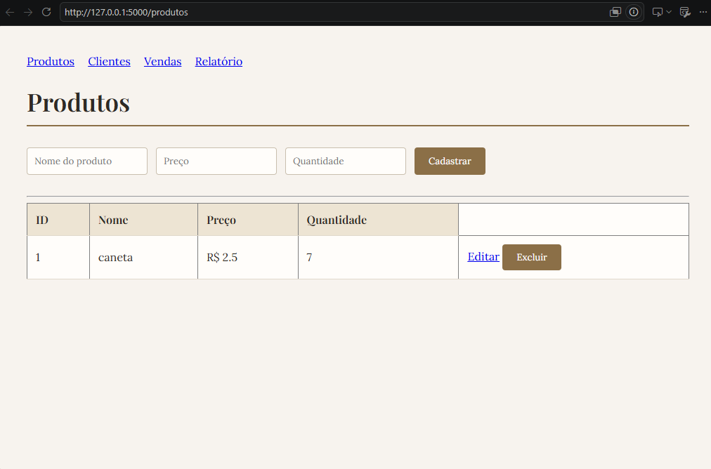
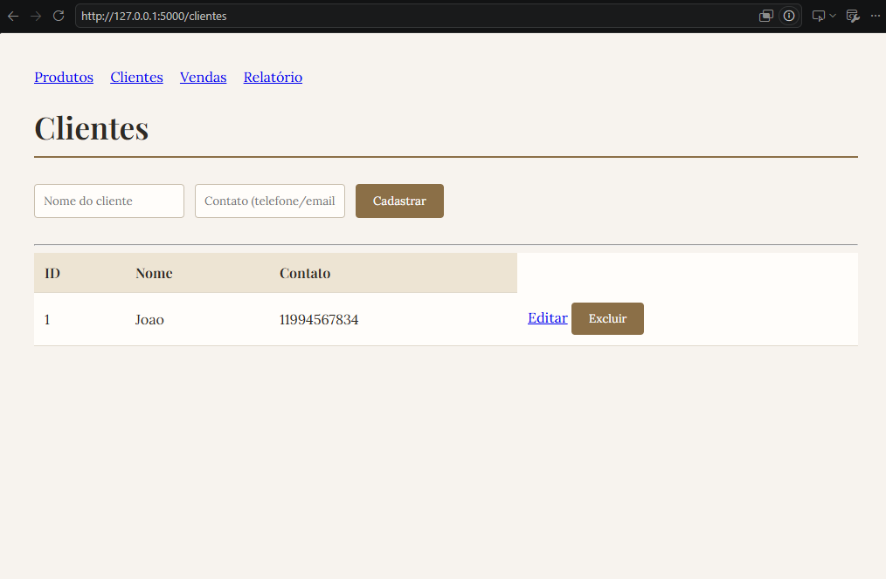
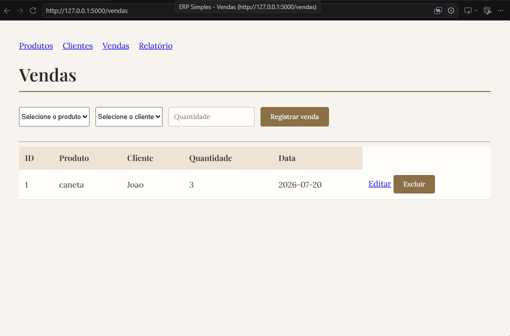
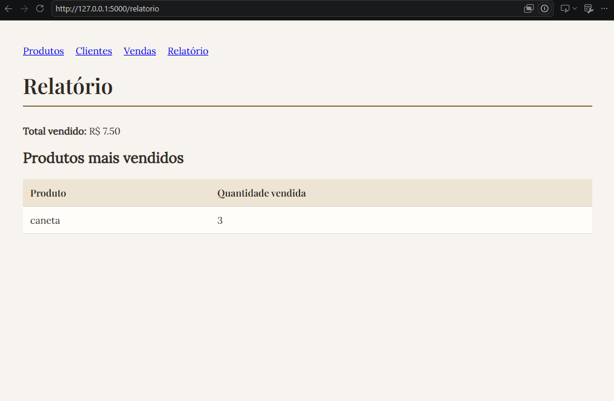

# ERP Simples

Sistema de gestão para pequeno negócio, desenvolvido como projeto de portfólio.

## Sobre o projeto

Este sistema permite gerenciar produtos, clientes e vendas de um pequeno comércio,
com controle automático de estoque e relatório de vendas.

## Funcionalidades

- Cadastro e listagem de produtos (com controle de estoque)
- Cadastro e listagem de clientes
- Registro de vendas com baixa automática de estoque
- Validação de estoque insuficiente
- Relatório de faturamento total e produtos mais vendidos

## Tecnologias utilizadas

- Python
- Flask
- SQLite
- HTML/CSS (Jinja2)

## Como rodar o projeto

1. Clone o repositório:

```bash
git clone https://github.com/SEU-USUARIO/erp-simples.git
```

2. Acesse a pasta do projeto:

```bash
cd erp-simples
```

3. Instale as dependências:

```bash
pip install flask
```

4. Crie o banco de dados:

```bash
python database.py
```

5. Rode o servidor:

```bash
python app.py
```

6. Acesse no navegador:

```text
http://127.0.0.1:5000
```

## Capturas de tela

### Produtos


### Clientes


### Vendas


### Relatório


## Autor

Lucas Rocha Sampaio Costa
